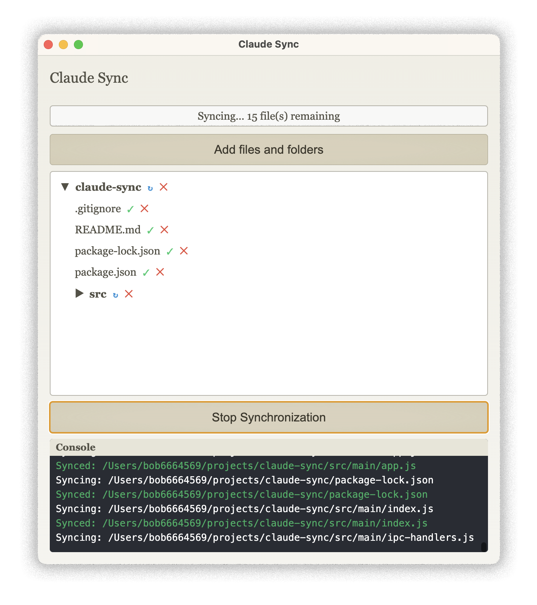
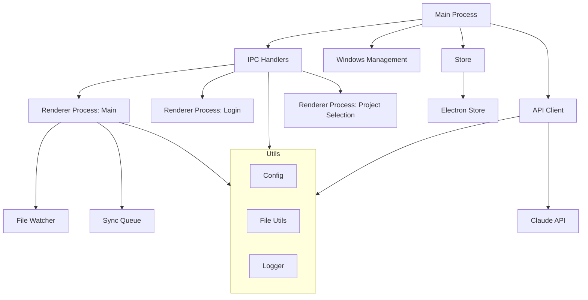

# Claude Sync




Claude Sync is a desktop application developed with Electron for synchronizing files with Claude's "Projects" feature. It provides an intuitive user interface for selecting and syncing files and folders with your Claude projects.

## Features

- Using Claude authentication with the default magic link system
- Selection of files and folders to synchronize with Claude Projects
- Intuitive user interface with file tree visualization
- Real-time console for tracking file modifications
- Dark mode support

## Prerequisites

- Node.js (version 18.0.0 or higher)
- npm (usually installed with Node.js)

## Installation
 
1. Clone this repository:
   ```
   git clone git@github.com:bob6664569/claude-sync.git
   ```

2. Navigate to the project folder:
   ```
   cd claude-sync
   ```

3. Install dependencies:
   ```
   npm install
   ```

## Configuration

Just create a `.env` file in the root of the project and add the necessary environment variables:
```
API_URL=https://api.claude.ai/api/
```

## Usage

1. To launch the application in development mode:
   ```
   npm start
   ```

2. To build the application for production:
   ```
   npm run build
   ```

## Project Structure

```
claude-sync/
├── src/
│   ├── main/
│   │   ├── index.js
│   │   ├── api-client.js
│   │   ├── ipc-handlers.js
│   │   ├── menu.js
│   │   ├── store.js
│   │   └── windows.js
│   ├── renderer/
│   │   ├── login.html
│   │   ├── login.js
│   │   ├── main.html
│   │   ├── main.js
│   │   ├── project-selection.html
│   │   ├── project-selection.js
│   │   └── styles.css
│   └── utils/
│       ├── config.js
│       ├── file-utils.js
│       └── logger.js
├── package.json
├── README.md
└── .gitignore
```



## Contributing

Contributions are welcome! To contribute:

1. Fork the project
2. Create your feature branch (`git checkout -b feature/AmazingFeature`)
3. Commit your changes (`git commit -m 'Add some AmazingFeature'`)
4. Push to the branch (`git push origin feature/AmazingFeature`)
5. Open a Pull Request

## License

This project is licensed under the WTFPL (Do What The F*ck You Want To Public License). For more information, see the [LICENSE](LICENSE) file in this repository or visit [http://www.wtfpl.net/](http://www.wtfpl.net/).

## Contact

[@bob6664569](https://twitter.com/bob6664569) - johan@trilogik.net

Project Link: [https://github.com/bob6664569/claude-sync](https://github.com/bob6664569/claude-sync)